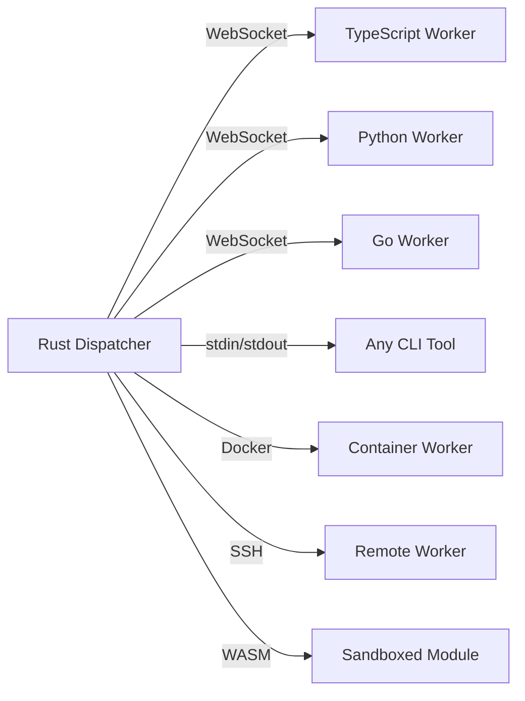
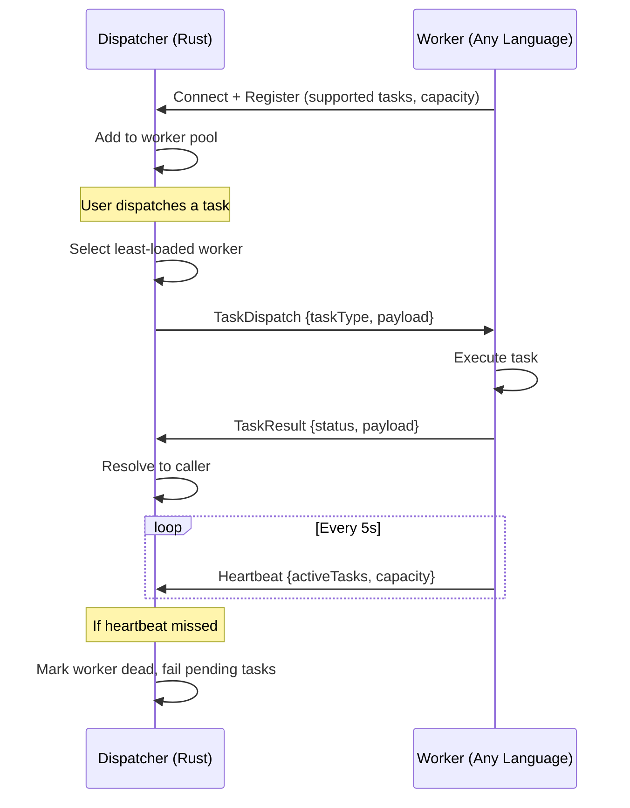
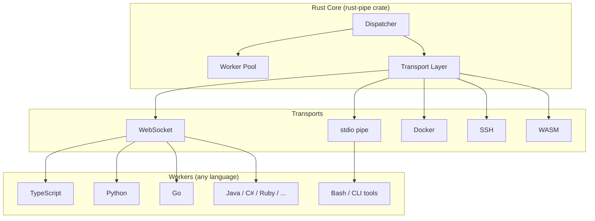
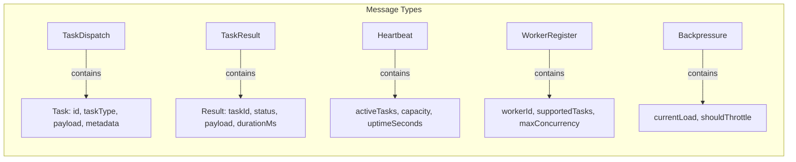
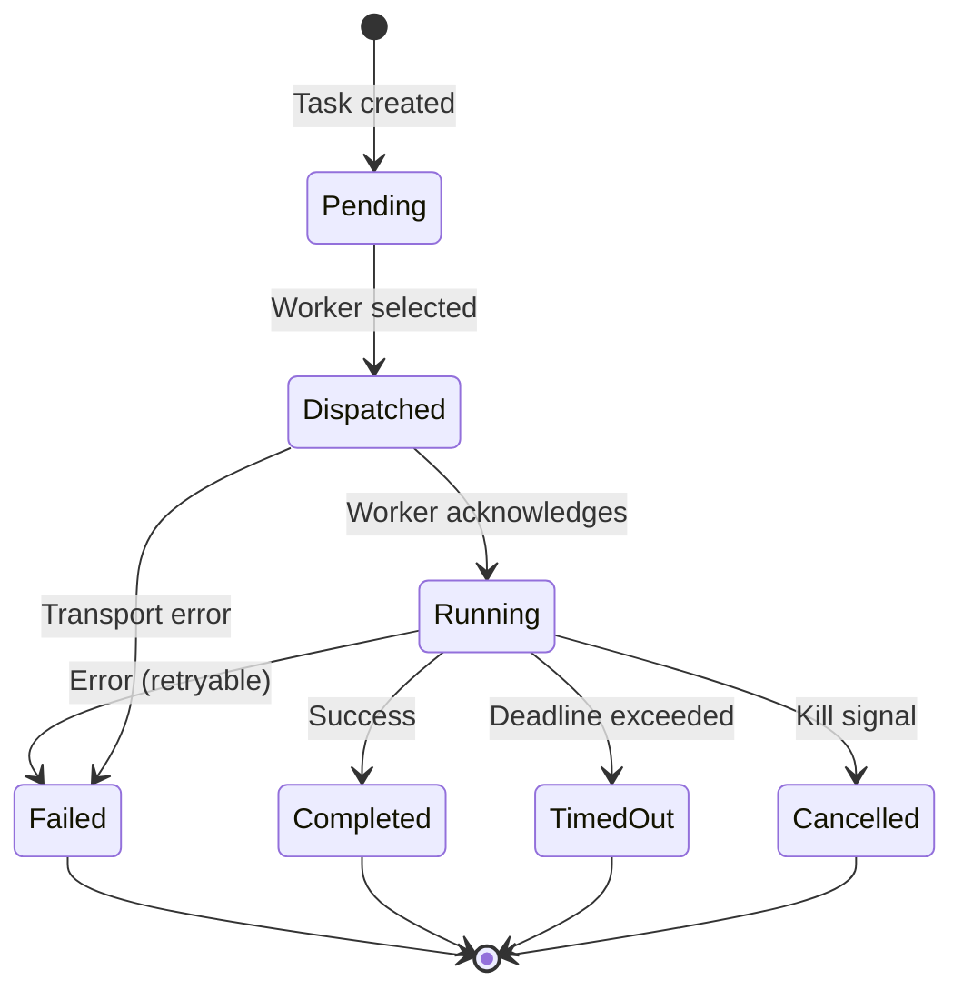

# rust-pipe

Lightweight typed task dispatch from Rust to polyglot workers (TypeScript, Python, Go, Java, C#, Ruby, Elixir, Swift, PHP).

[](https://crates.io/crates/rust-pipe)
[](https://docs.rs/rust-pipe)
[](LICENSE-MIT)

## What it does

rust-pipe sits between "raw gRPC" (too low-level) and "Temporal" (too heavy). It gives you typed task dispatch from a Rust orchestrator to workers written in any language — with zero boilerplate.



## How it works



## Architecture



## Features

| Feature | Description |
|---------|-------------|
| **Least-loaded routing** | Tasks go to the worker with most available capacity |
| **Dead worker detection** | Heartbeat timeout marks workers dead, fails their pending tasks |
| **Backpressure** | Workers signal overload, dispatcher throttles |
| **Graceful shutdown** | `stop()` drains tasks and cleanly disconnects |
| **Input validation** | All transport configs validated against command injection |
| **Idempotent start** | Safe to call `start()` multiple times |

## Transports

| Transport | Use case | Requires SDK? |
|-----------|----------|---------------|
| **WebSocket** | Networked workers, auto-scaling pools | Yes (any language SDK) |
| **stdio** | Any CLI tool as a worker | No — just JSON on stdin/stdout |
| **Docker** | Isolated containers per task | No — just a Docker image |
| **SSH** | Dispatch to remote machines | No — runs any command over SSH |
| **WASM** | Sandboxed, portable execution | No — any WASI-compatible module |

## Quick start

### Rust (dispatcher)

```rust
use rust_pipe::prelude::*;
use serde_json::json;
use std::time::Duration;

#[tokio::main]
async fn main() -> anyhow::Result<()> {
    let dispatcher = Dispatcher::builder()
        .host("0.0.0.0")
        .port(9876)
        .build();

    dispatcher.start().await?;

    // Workers connect via WebSocket and register their supported task types.
    // Once connected, dispatch tasks:
    let task = Task::new("scan-target", json!({
        "url": "https://example.com",
        "checks": ["xss", "sqli"]
    }))
    .with_timeout(60_000)
    .with_priority(Priority::High);

    let handle = dispatcher.dispatch(task).await?;
    let result = handle.await_with_timeout(Duration::from_secs(60)).await?;

    println!("Result: {:?}", result.payload);
    Ok(())
}
```

### TypeScript (worker)

```typescript
import { createWorker } from '@rust-pipe/worker';

const worker = createWorker({
  url: 'ws://localhost:9876',
  handlers: {
    'scan-target': async (task) => {
      // Do work...
      return { vulnerabilities: 3 };
    },
  },
});

await worker.start();
```

### Python (worker)

```python
from rust_pipe import create_worker

async def scan_target(task):
    # Do work...
    return {"vulnerabilities": 3}

worker = create_worker(
    url="ws://localhost:9876",
    handlers={"scan-target": scan_target},
)
await worker.start()
```

### Bash (worker via stdio — no SDK needed)

```bash
#!/bin/bash
# Read JSON task from stdin, write JSON result to stdout
while IFS= read -r line; do
  task_id=$(echo "$line" | jq -r '.task.id')
  echo "{\"type\":\"TaskResult\",\"result\":{\"taskId\":\"$task_id\",\"status\":\"Completed\",\"payload\":{\"done\":true},\"durationMs\":1,\"workerId\":\"bash\"}}"
done
```

## SDKs

| Language | Package | Install |
|----------|---------|---------|
| TypeScript | `@rust-pipe/worker` | `npm install @rust-pipe/worker` |
| Python | `rust-pipe` | `pip install rust-pipe` |
| Go | `rust-pipe-go` | `go get github.com/albyte-ai/rust-pipe-go` |
| Java | `io.rustpipe:rust-pipe-worker` | Maven Central |
| C# | `RustPipe.Worker` | `dotnet add package RustPipe.Worker` |
| Ruby | `rust_pipe` | `gem install rust_pipe` |
| Elixir | `rust_pipe` | `{:rust_pipe, "~> 0.1.0"}` in mix.exs |
| Swift | `RustPipe` | Swift Package Manager |
| PHP | `rust-pipe/worker` | `composer require rust-pipe/worker` |
| **Any CLI** | None needed | Read/write JSON on stdin/stdout |

## Wire protocol



All communication uses JSON over WebSocket (or stdin/stdout for stdio transport). Messages are internally tagged with a `"type"` field:

```json
{"type": "TaskDispatch", "task": {"id": "...", "taskType": "scan", "payload": {...}, "metadata": {...}}}
{"type": "TaskResult", "result": {"taskId": "...", "status": "Completed", "payload": {...}, "durationMs": 150, "workerId": "w1"}}
{"type": "Heartbeat", "payload": {"workerId": "w1", "activeTasks": 2, "capacity": 10, "uptimeSeconds": 300}}
```

All fields use camelCase. Status values: `Completed`, `Failed`, `TimedOut`.

## Task lifecycle



## Safety

- Input validation on all transport configs (prevents command injection)
- Scope enforcement via worker IDs and task types
- Resource limits on Docker/WASM transports
- Heartbeat-based dead worker detection
- Pending tasks for dead workers are automatically failed (no hanging)
- Idempotent `start()`, graceful `stop()`

## License

Licensed under either of:

- Apache License, Version 2.0 ([LICENSE-APACHE](LICENSE-APACHE))
- MIT License ([LICENSE-MIT](LICENSE-MIT))

at your option.
